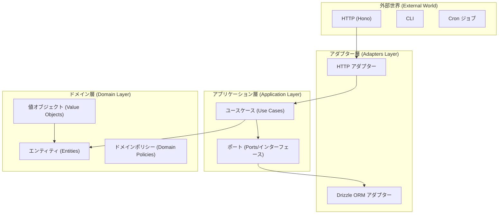

# 🚀 Hono Template - 本番環境向けクリーンアーキテクチャ

[](https://opensource.org/licenses/MIT)
[](https://bun.sh)
[](https://nodejs.org)

大規模でメンテナンス可能なWebアプリケーションのために設計された、最先端のモノレポテンプレートです。**Hono**、**Drizzle ORM**、**Zod** を採用し、厳格な **クリーンアーキテクチャ** と **ドメイン駆動設計 (DDD)** の原則に従っています。

[English README](./README.md)

---

## 🏗️ アーキテクチャの哲学

このプロジェクトは **「置換可能性とテスト容易性 (Replaceability & Testability)」** の原則に基づいて構築されています。ビジネスロジックを外部フレームワークやツールから切り離すことで、アプリケーションのコア部分を安定させ、テストを容易にします。



---

## 📁 リポジトリ構造

```
repo/
├── apps/
│   └── api/                    # 🚀 APIエントリポイント (サーバー初期化、DI設定)
├── packages/
│   ├── foundation/             # 🛠️ 共通インフラ & コア
│   │   ├── app-core/          # DIコンテナ、設定、ロガー、グローバルエラー定義
│   │   ├── auth-suite/        # ID & アクセス管理 (IAM)
│   │   ├── db/                # Drizzle ORMスキーマ & マイグレーション管理
│   │   └── contracts/         # ユニバーサルZodスキーマ & 共有型定義
│   ├── adapters/               # 🔌 サードパーティ統合 (ポートの実装)
│   │   ├── http-hono/         # Honoミドルウェア、エラーハンドラー
│   │   └── db-drizzle/        # リポジトリ & ストアの実装
│   └── domains/               # 💼 純粋なビジネスロジック (ドメインパッケージ)
│       └── [domain-name]/     # 隔離されたドメインロジック (例: billing, ordering)
└── docs/                      # 📚 アーキテクチャ & プロジェクトドキュメント
```

---

## 🧠 ビジネスロジック実装ガイド

このアーキテクチャでの開発は、**「内側から外側へ (Inside-Out)」** のアプローチで行います。常にドメインから開始し、アダプターへと進みます。

### 1. ドメインの定義 (「何」をなすか)
`packages/domains/[domain-name]/src/domain` から始めます。**エンティティ** と **値オブジェクト** を定義します。これらは Hono や Drizzle などのフレームワークへの依存を一切持たないようにします。

```typescript
// 例: packages/domains/billing/src/domain/Subscription.ts
export class Subscription {
  constructor(private readonly data: { id: string; status: 'active' | 'expired' }) {}
  
  isValid(): boolean {
    return this.data.status === 'active';
  }
}
```

### 2. コントラクトの定義 (「どのように見えるか」)
`packages/domains/[domain-name]/contracts.ts` で **Zod** を使用してデータ形状を定義します。これはドメインとAPIの両方における唯一の真理の源 (Single Source of Truth) となります。

### 3. アプリケーション層 & ポート (「ブリッジ」)
`packages/domains/[domain-name]/src/application` で以下を定義します：
- **ポート (Ports)**: 操作のためのインターフェース (例: `ISubscriptionRepository`)。
- **ユースケース (Use Cases)**: ドメインロジックを統合・実行します。

### 4. インフラストラクチャ層 (「どのように動作するか」)
`packages/adapters/db-drizzle` (データベース用) や、ドメイン内のインフラフォルダ (特殊なサービス用) でポートを実装します。

### 5. HTTPアダプター (「入口」)
`packages/adapters/http-hono` で、以下を行うコントローラー/ハンドラーを作成します：
1. Zodコントラクトを使用して入力を検証する。
2. ユースケースを呼び出す。
3. ドメインの結果やエラーをHTTPレスポンスにマッピングする。

### 6. 依存性の注入 (「接着剤」)
`apps/api/src/di/index.ts` (またはドメイン固有のDI設定) ですべてを登録します。これにより、すべてのコンポーネントが自動的に接続され、コンテナを介して利用可能になります。

---

## 🚀 クイックスタート

### 前提条件
- [Bun](https://bun.sh) (APIランタイムに必須)
- Node.js 20+ (型チェック/テスト/リントなどのツール用途)
- [pnpm](https://pnpm.io) 8+
- [Docker](https://www.docker.com/) (ローカルデータベース用)

### セットアップ
```bash
pnpm install
cp .env.example .env
docker compose up -d # PostgreSQLを起動
pnpm db:migrate      # マイグレーションを実行
pnpm dev             # APIサーバーを起動 (Bun)
```

---

## 🔐 セキュリティ & 信頼性

このテンプレートは、現代のセキュリティのベストプラクティスで強化されています：

- **🔐 堅牢な認証**: 
  - Argon2 (Argon2id) による高性能で安全なパスワードハッシュ化。
  - データベースに **トークンのハッシュ値** を保存するセッション管理。万が一DBが漏洩しても、セッションが即座に乗っ取られるのを防ぎます。
  - `SESSION_TTL` による固定TTL（デフォルトはスライディング更新なし）。
- **🛡️ 型安全**: 
  - 厳格なTypeScript設定。
  - すべてのリクエストとレスポンスに対する Zod バリデーション。
- **📝 監査ログ**: 
  - セキュリティに関わる重要なアクション (ログイン、ログアウト、登録、ログイン失敗) を自動追跡し、`jsonb` 形式で保存。高度なクエリが可能です。
- **⚡ エラーハンドリング**: 
  - 中央集権的なエラー階層。HTTPステータスコードへの自動マッピング機能を備えています。

---

## 🧪 テスト戦略

**テスト・ファースト (Test-First)** での開発を推奨しています。

- **ユニットテスト**: エンティティや値オブジェクトを分離してテスト。
- **ユースケーステスト**: インフラ依存関係に **インメモリ・フェイク (In-Memory Fakes)** を使用し、テストを高速に保ちます。
- **統合テスト**: データベースとの相互作用を検証。
- **APIテスト**: `hono.request()` を使用し、実際のポートを開かずにエンドポイントのエンドツーエンド検証を行います。

```bash
pnpm test          # すべてのテストを実行
pnpm test:coverage # カバレッジレポートを作成
```

---

## 📈 モニタリング & オブザーバビリティ

- **構造化ログ**: Trace ID を備えた Pino ベースのロガー。
- **リクエストコンテキスト**: ミドルウェアからリポジトリまで、すべてのリクエストをユニークな ID で追跡。
- **ヘルスチェック**: DB接続性を含むディープなヘルスチェック。

---

## 📄 ライセンス

MIT © ugnoguchigxp
