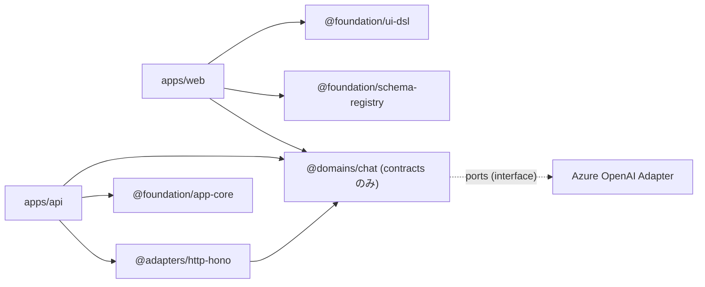

# AI UI DSL v0.1 実装計画書

## プロジェクト概要

本計画は、ChatGPTライクな会話型チャットUIをメインの基盤とし、AIからの応答に従って動的なUI（AI UI DSL v0.1）を描画する **マルチモーダルインターフェース** の実装を目指すものです。

対象となるシステムアーキテクチャは、現在のモノレポ構成（`apps/web`, `apps/api`, `packages/*` からなる React + Hono テンプレート）に準拠して進めます。
チャット機能のバックエンドAIエンジンとして **Azure OpenAI Service（GPT-5.1 モデル）** を利用し、接続情報は `.env` ファイルで環境変数として管理します。

---

## 1. 技術スタック

| 領域 | 採用技術 | 備考 |
|---|---|---|
| UI フレームワーク | React 19 + TypeScript (strict) | `apps/web` (Vite 7) |
| デザインシステム | `@ui/design-system` (shadcn/ui + Tailwind ベース) | 直接 shadcn/ui のインストールは禁止（`CLAUDE.md` ルール） |
| スタイリング | Tailwind CSS v4 | `@tailwindcss/vite` プラグイン使用 |
| フォーム管理 | React Hook Form + `@hookform/resolvers/zod` | 既存依存に含まれる |
| データ取得 | TanStack Query (`@tanstack/react-query`) | SSE ストリーミング対応 |
| ルーティング | TanStack Router (`@tanstack/react-router`) | Zod パラメータ検証 |
| DSL / スキーマバリデーション | Zod | Zodスキーマ → `z.infer` で型導出（型の二重定義禁止） |
| バックエンド | Hono + Bun | `apps/api` |
| AI エンジン | Azure OpenAI Service (GPT-5.1) | SSE ストリーミング応答 |
| テスト | Vitest | ユニットテスト |

---

## 2. ベースUIとマルチモーダル表示の仕様

### 2.1 チャット風ベースUI

* **メインストリーム**: ユーザーとAIのチャット履歴（テキスト＋UIコンポーネント）が時系列で流れる画面。
* **AIレスポンスの二面性**:
  * **テキスト応答**: 通常のマークダウンテキストとしてチャットバブルに描画。
  * **DSL 応答**: AI が `ui-dsl/0.1` スキーマの JSON を返した場合、DSLレンダラーがパースし、チャットストリーム内にインラインでウィジェット・フォーム・レイアウトを展開。

### 2.2 マルチモーダル描画領域

* `layout.shell` の `responsive` プロパティに従い、デスクトップでは画面右側のサイドパネル、モバイルではドロワーとして動的に領域を切り替える。
* スロット（`left` / `main` / `right`）内には任意の UI ノード（レイアウトコンポーネント・ウィジェット）を配置可能。ネストに制限なし。

### 2.3 Azure OpenAI 連携アーキテクチャ

```
[ブラウザ] ←SSE→ [apps/api (Hono)] ←REST→ [Azure OpenAI Service]
                       ↓
              SSE ストリーミングでチャンクを中継
              JSON DSL 検出時にUIメッセージとして分離
```

* `apps/api` が Azure OpenAI の Chat Completions API を呼び出し、SSE (Server-Sent Events) でフロントへ中継する。
* AI 応答内に `ui-dsl/0.1` スキーマの JSON ブロックが含まれる場合、フロント側でパースしマルチモーダルUIとしてレンダリング。

**環境変数** (`.env`):

```dotenv
AZURE_OPENAI_API_KEY=your-azure-openai-api-key
AZURE_OPENAI_ENDPOINT=https://your-resource-name.openai.azure.com/
AZURE_OPENAI_DEPLOYMENT_ID=gpt-51-deployment-name
AZURE_OPENAI_API_VERSION=2024-02-15-preview
```

---

## 3. UI DSL v0.1 仕様

### 3.1 `widget.navTree` — nav フィールド

```json
{
  "type": "widget.navTree",
  "props": {
    "items": [
      {
        "id": "orders",
        "label": "Orders",
        "nav": { "intent": "orders.list", "params": {} },
        "children": [
          {
            "id": "orders.new",
            "label": "New Order",
            "nav": { "intent": "orders.new" }
          }
        ]
      }
    ]
  }
}
```

* `children` を持つアイテムはアコーディオン展開のみとし、自身の `nav` は発火しない。

### 3.2 `state` オブジェクト

```json
"state": {
  "userId": "u_123",
  "cartItems": 3
}
```

* **型**: `Record<string, string | number | boolean | null>`
* ネストは v0.1 スコープ外。
* `include: ["state"]` 指定時、state 内の全キーをナビゲーション（intent）リクエストのペイロードに含める。

### 3.3 エラー表示ルール

| ケース | 表示方法 |
|---|---|
| フォームフィールドバリデーションエラー | フィールド直下にインライン表示 |
| フォーム送信時エラー | フォーム上部にサマリー表示 |
| Schema Registry 取得失敗 | フォームを `disabled` 状態でレンダリング ＋ エラーバナー |
| Intent 解決失敗 | 現在の画面を維持 ＋ エラートースト |

### 3.4 `validateOn` のスコープ

* v0.1 では `blur` のみをサポート。
* `change` / `submit-only` は v0.2 以降で対応。

---

## 4. モノレポ構成への統合

既存のクリーンアーキテクチャ構成（Domain → Application → Adapter）に従い、以下のモジュールを新規追加します。

### 4.1 新規パッケージ

```
packages/
├── foundation/
│   ├── ui-dsl/           # [NEW] DSL型定義 + Zodバリデーション + パーサー
│   │   ├── src/
│   │   │   ├── types.ts          # UiSchema, UINode, NavAction 等の型
│   │   │   ├── schemas.ts        # Zodスキーマ群
│   │   │   ├── parser.ts         # DSL JSON → 型安全オブジェクトへ変換
│   │   │   └── index.ts
│   │   ├── package.json          # @foundation/ui-dsl
│   │   └── tsconfig.json
│   │
│   └── schema-registry/  # [NEW] JSON Schema → Zod 変換ユーティリティ
│       ├── src/
│       │   ├── jsonSchemaToZod.ts # JSON Schema → Zod 変換
│       │   ├── types.ts
│       │   └── index.ts
│       ├── package.json          # @foundation/schema-registry
│       └── tsconfig.json
│
└── domains/
    └── chat/              # [NEW] チャットドメイン
        ├── src/
        │   ├── Message.ts         # メッセージエンティティ (text / dsl)
        │   ├── Conversation.ts    # 会話集約
        │   ├── contracts.ts       # Zodスキーマ群
        │   └── ports.ts           # IAiChatService, IConversationRepository
        ├── package.json           # @domains/chat
        └── tsconfig.json
```

### 4.2 既存モジュールの拡張

| モジュール | 変更内容 |
|---|---|
| `apps/web` | Chat UI 画面、DSL レンダラー、テーマエンジン、IntentDispatcher を追加 |
| `apps/api` | Azure OpenAI プロキシ（SSE中継）、Schema Registry API（モック → 本実装）、Chat Completions エンドポイントを追加 |
| `packages/adapters/http-hono` | Azure OpenAI 用ハンドラー・ミドルウェアを追加 |

### 4.3 依存方向（クリーンアーキテクチャ準拠）



> **ルール**: ドメイン層は HTTP フレームワーク非依存。依存方向は外→内のみ（`CLAUDE.md` 準拠）。

---

## 5. 実装フェーズ

### フェーズ1：コア基盤とチャットUI（2週間）

1. **チャットUI の実装** (`apps/web`)
   * メッセージストリーム（ユーザー / AI バブル）、入力エリア、会話履歴の基盤。
   * `@ui/design-system` のコンポーネントを活用した UI 構築。

2. **Azure OpenAI 連携** (`apps/api` + `@adapters/http-hono`)
   * `POST /api/chat/completions` — Azure OpenAI の Chat Completions API を SSE ストリーミングで中継するエンドポイント。
   * フロント側：`TanStack Query` + `EventSource` で SSE を受信し、チャットメッセージをリアルタイム描画。

3. **DSL パーサー & 型定義** (`@foundation/ui-dsl`)
   * `UiSchema` 型と Zod バリデーションスキーマの実装。

4. **レイアウトレンダラー & 基本ウィジェット** (`apps/web`)
   * `layout.shell` / `layout.stack` / `layout.grid` / `layout.section` の実装。
   * `widget.button` / `widget.input` / `widget.select` / `widget.numberInput` / `widget.submitButton` の実装。
   * `@ui/design-system` のコンポーネントへのマッピング。

5. **テーマエンジン**
   * DSL の `theme` オブジェクトを Tailwind v4 のCSS変数・カスタムプロパティに変換するマッピング。
   * `accent: "auto"` はホスト Chat UI の CSS 変数を継承。

**完了基準**: サンプル JSON（付録A）をチャットの AI 応答として渡し、エラーなく UI コンポーネントとしてインライン描画できること。

---

### フェーズ2：フォーム & バリデーション（1.5週間）

1. **Schema Registry クライアント**
   * `apps/api`: `GET /ui/schemas/:id` のモック API 実装。
   * `apps/web`: `useSchema` フック（`sessionStorage` キャッシュ）。取得失敗時は `disabled` フォーム ＋ エラーバナー。

2. **JSON Schema → Zod 変換** (`@foundation/schema-registry`)
   * 対応キーワード: `type`, `required`, `format: email`, `minLength`, `maxLength`, `minimum`, `maximum`
   * 未対応キーワードは `console.warn` で通知し無視。

3. **動的フォームシステム** (`apps/web`)
   * React Hook Form + Zod resolver で `widget.form` と各フィールドを構築。
   * `validateOn: blur` → `mode: "onBlur"` トリガーで実装。
   * エラー表示: フィールド直下インライン + submit 時フォーム上部サマリー。

**完了基準**: Chat UI 上に描画されたフォームにおいて、blur / submit バリデーションが正常動作し、エラー表示ルールが適用されること。

---

### フェーズ3：ナビゲーションとインテント連携（1週間）

1. **IntentDispatcher フック** (`apps/web`)
   * `useIntentDispatcher` — `intent` + `params` + `include` 解決結果を `apps/api` 経由で送信。
   * `include: ["state"]` → 現在の state 全キーを取得。
   * `include: ["form:<formId>"]` → 対象フォームの現在値を取得。
   * 両者をマージしてリクエストボディを構築。

2. **widget.button / widget.navTree の nav 実装**
   * クリック時に `IntentDispatcher.dispatch(nav)` を呼び出し。
   * Intent 解決失敗時はエラートーストを表示し、現在画面を維持。

3. **Chat UI との統合サイクル**
   * ウィジェット操作 → Intent 送信 → Azure OpenAI 呼び出し → 次の UI JSON 応答受信 → 再レンダリング のフルサイクルを確立。

**完了基準**: ボタンクリックで intent が発火し、新しい UI JSON を受信して再描画できること。

---

### フェーズ4：品質・統合（1週間）

1. **エラーバウンダリ**
   * DSL パース失敗・レンダリングエラーをキャッチしてフォールバック UI を表示。

2. **レスポンシブ対応の検証**
   * `layout.shell` の `responsive` プロパティ（`drawer` / `inline`）を実ブレークポイントで検証。

3. **アクセシビリティ**
   * 各ウィジェットに適切な ARIA ラベル・ロールを付与。
   * フォームエラーは `aria-describedby` で関連付け。

4. **ユニットテスト (Vitest)**
   * DSL パーサー、JSON Schema → Zod 変換、IntentDispatcher のユニットテスト。

**完了基準**: フェーズ1〜3 の主要ロジックがユニットテストでカバーされていること。

---

## 6. リスクと対策

| リスク | 影響度 | 対策 |
|---|---|---|
| JSON Schema → Zod 変換の網羅性不足 | 高 | サポートキーワードをホワイトリスト化し、未対応は warning で無視 |
| Azure OpenAI のレート制限・レイテンシ | 高 | SSE ストリーミングで体感速度を改善。リトライ＋エクスポネンシャルバックオフ実装 |
| Chat UI ストリームと DSL レンダリングの競合 | 高 | DSL パーサーはステートレスとし、UI オブジェクト単位で独立したレンダリングコンテキストを確保 |
| Schema Registry API の整備遅れ | 中 | フェーズ1 からモック API を `apps/api` に実装し、開発のブロッカーにしない |
| `@ui/design-system` と DSL テーマのマッピング差異 | 中 | フェーズ1 でマッピング表を作成しデザインレビューを実施 |
| Azure OpenAI の CORS・認証 | 中 | `apps/api` をプロキシとして利用し、フロントから直接 Azure を呼ばない |

---

## 7. v0.2 以降の候補

- 権限制御（role ベースの UI 制御）
- サイドバー Collapse
- `validateOn: change` / `submit-only`
- Schema Registry の `type: "inline"` 定義
- パフォーマンス最適化・仮想スクロール
- API データ流し込み自動化
- 会話履歴の永続化（DB 保存）
- マルチターン コンテキスト管理の高度化

---

## 付録A：サンプル UI JSON（検証用）

```json
{
  "schema": "ui-dsl/0.1",
  "screen": {
    "id": "checkout",
    "title": "Checkout"
  },
  "theme": {
    "accent": "brand",
    "textSize": "md",
    "density": "comfortable",
    "radius": "md"
  },
  "schemaRegistry": {
    "type": "http",
    "baseUrl": "/ui/schemas",
    "cache": "session"
  },
  "forms": {
    "checkout": {
      "schemaRef": "Checkout.v1",
      "initial": {},
      "validateOn": "blur"
    }
  },
  "state": {
    "userId": "u_123"
  },
  "ui": {
    "type": "layout.shell",
    "props": {
      "responsive": {
        "base": { "left": "drawer", "right": "hidden" },
        "md": { "left": "inline", "right": "hidden" }
      }
    },
    "slots": {
      "left": {
        "type": "widget.navTree",
        "props": {
          "items": [
            {
              "id": "orders",
              "label": "Orders",
              "nav": { "intent": "orders.list" }
            }
          ]
        }
      },
      "main": {
        "type": "layout.section",
        "props": { "title": "Order Information" },
        "children": [
          {
            "type": "widget.form",
            "props": { "formId": "checkout" },
            "children": [
              {
                "type": "widget.input",
                "props": { "name": "email", "label": "Email" }
              },
              {
                "type": "widget.submitButton",
                "props": { "text": "Place Order" },
                "nav": {
                  "intent": "orders.confirm",
                  "include": ["form:checkout", "state"]
                }
              }
            ]
          }
        ]
      }
    }
  }
}
```
